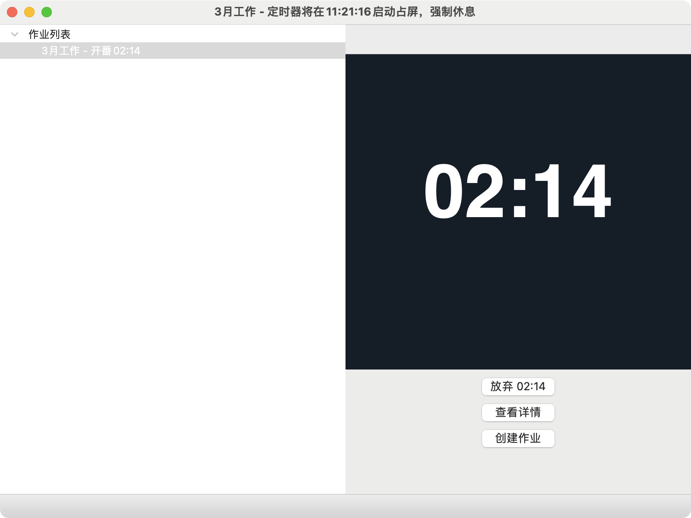

# xingheng-python

[行恒晚自习官网](https://www.51zhi.com/)

行恒晚自习桌面客户端python版本

## 安装

- 需要先安装python 3.11版本软件
- 下载代码
- 打开终端
- 进入代码目录`cd src`，运行命令: `pip install -r requirements.txt`

## 运行

- 打开终端
- 进入代码目录`src`，运行命令: `python app.py`

